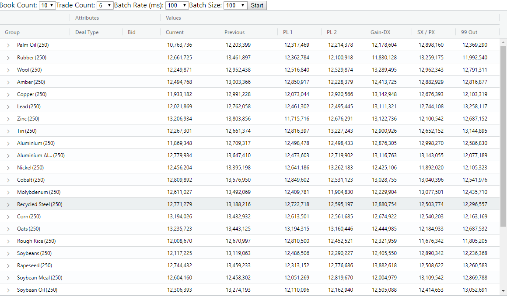

## AG-Grid Stress Test using GraphQL and Apollo



This is a conversion of the [AG-Grid Streaming Stress Test](https://blog.ag-grid.com/streaming-updates-in-javascript-datagrids/) that uses GraphQL and Apollo. A Query is used to initially populate the grid, with subsequent updates handled over websocket with a Subscription.

Performance is very good. There's only one 'trick' employed, which is to set 'fetchPolicy' to 'no-cache' for the subscription.

In the Grid.jsx component:

```js
useSubscription(ROWS_UPDATED, {
  fetchPolicy: 'no-cache',
  onSubscriptionData: ({
    subscriptionData: {
      data: { rowsUpdated }
    }
  }) => {
    if (gridApi) {
      gridApi.batchUpdateRowData({ update: rowsUpdated });
    }
  }
});
```

This makes sense,because Ag-Grid is already maintaining rowData internally, so also storing it in Apollo's cache would be redundant.

After running `yarn install` in both the root and server directories, start the server with

```
yarn server
```

And then start the app with

```
yarn start
```
